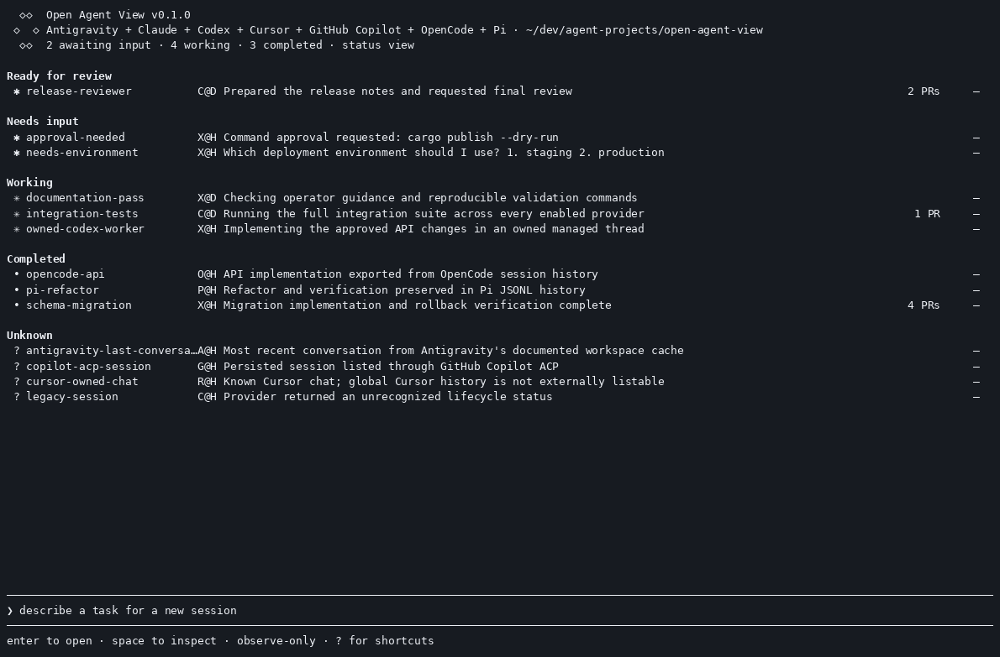
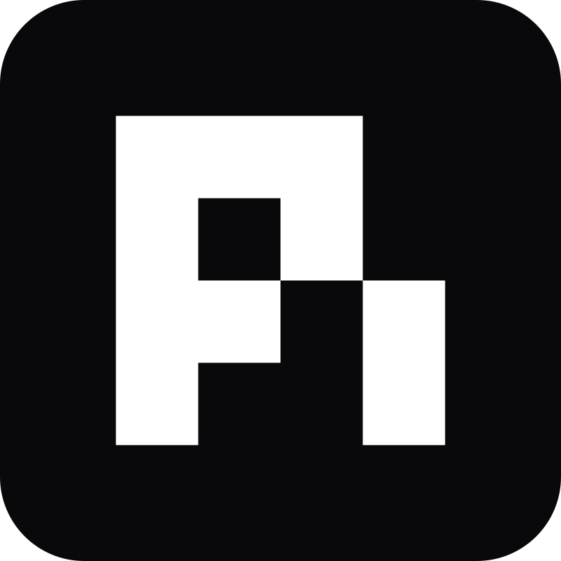
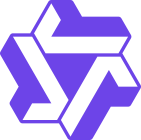

<div align="center">

<h1> Open Agent View</h1>

**One agent view for every coding harness.**<br>
See what’s running, what needs you, and where to step in. Available for 15+
harnesses.

<table align="center">
  <tr>
    <td align="center"><a href="https://open-agent-view.github.io/"><strong>Explore the website →</strong></a></td>
  </tr>
</table>

[](docs/testing.md)
[](https://github.com/xhluca/open-agent-view/releases/latest)
[](LICENSE)

</div>

## Quick start

Install Open Agent View:

```console
curl -fsSL https://open-agent-view.github.io/install.sh | bash
```

Launch the dashboard:

```console
open-agent-view
```

The installer also adds the shorter `opav` command. Start typing a task, press
`Tab` to choose a harness, and press `Shift+Tab` to choose one of that account's
available models.

[](https://open-agent-view.github.io/open-agent-view-demo.mp4)

<p align="center"><a href="https://open-agent-view.github.io/open-agent-view-demo.mp4"><strong>Watch the demo as MP4 →</strong></a></p>

## Why Open Agent View?

Claude Code users already know the value of an agent view: one place to follow
background work and notice when an agent needs help. Other coding harnesses
should not require a separate pile of terminal tabs.

Open Agent View brings Claude Code, Codex, Cursor, GitHub Copilot, OpenCode, Pi,
Oh My Pi, Antigravity, Mistral Vibe, Muse Code, Qwen Code, Kimi Code, Grok,
Kilo Code, OpenHands, and ordinary terminal jobs into one open-source dashboard.
The conversation still lives in the harness that created it; selecting a row
opens that harness's native interface.

- **Know where to look.** Sessions are grouped as waiting for input, working,
  completed, or unknown, with the harness shown on every row.
- **Return without killing the task.** Open a native session, then move back to
  the dashboard while its work continues.
- **Stay fast as the list grows.** Discovery runs concurrently and the TUI only
  renders the page that fits the terminal.
- **Use controls OAV can prove.** Stop, reply, archive, and delete are offered
  only when the selected provider and session support them safely.

## The everyday workflow

| Do this | In the dashboard |
| --- | --- |
| Move through sessions | `↑` / `↓` |
| Open the selected native session | `Enter` or `→` |
| Return to OAV | `Shift+←`, or `←` twice at an empty prompt |
| Rename a session in OAV | `Ctrl+R` |
| Filter the session list | `Ctrl+F` |
| Stop, then delete or hide a managed session | `Ctrl+X`, then `Ctrl+X` again |
| See the complete contextual key map | `?` |

See the [CLI and keyboard guide](docs/cli.md) for model selection, login/setup,
completed-session visibility, paging, bulk actions, and non-interactive CLI
commands.

## Harnesses

Open Agent View brings these local coding harnesses—and regular terminals—into
one dashboard.

<table>
  <tr>
    <td align="center" width="25%"><a href="https://github.com/anthropics/claude-code"><br><strong>Claude Code</strong></a></td>
    <td align="center" width="25%"><a href="https://github.com/openai/codex"><br><strong>OpenAI Codex</strong></a></td>
    <td align="center" width="25%"><a href="https://cursor.com/cli"><br><strong>Cursor</strong></a></td>
    <td align="center" width="25%"><a href="https://github.com/github/copilot-cli"><br><strong>GitHub Copilot</strong></a></td>
  </tr>
  <tr>
    <td align="center"><a href="https://github.com/anomalyco/opencode"><br><strong>OpenCode</strong></a></td>
    <td align="center"><a href="https://pi.dev"><br><strong>Pi</strong></a></td>
    <td align="center"><a href="https://developers.google.com/antigravity"><br><strong>Antigravity</strong></a></td>
    <td align="center"><a href="https://github.com/mistralai/mistral-vibe"><br><strong>Mistral Vibe</strong></a></td>
  </tr>
  <tr>
    <td align="center"><a href="https://dev.meta.ai/"><br><strong>Muse Code</strong></a></td>
    <td align="center"><a href="https://github.com/QwenLM/qwen-code"><br><strong>Qwen Code</strong></a></td>
    <td align="center"><a href="https://github.com/MoonshotAI/kimi-cli"><br><strong>Kimi Code</strong></a></td>
    <td align="center"><a href="docs/cli.md"><br><strong>Terminal</strong></a></td>
  </tr>
  <tr>
    <td align="center"><a href="https://github.com/can1357/oh-my-pi"><br><strong>Oh My Pi</strong></a></td>
    <td align="center"><a href="https://github.com/xai-org/grok-build"><br><strong>Grok</strong></a></td>
    <td align="center"><a href="https://github.com/Kilo-Org/kilocode"><br><strong>Kilo Code</strong></a></td>
    <td align="center"><a href="https://github.com/OpenHands/OpenHands-CLI"><br><strong>OpenHands</strong></a></td>
  </tr>
</table>

<details>
<summary><strong>Compare feature support by harness</strong></summary>

| Harness | Launch | Model / shell picker | Open / resume | Inspect | Inline reply | Approval / input | Stop | Delete / archive |
| --- | :---: | :---: | :---: | :---: | :---: | :---: | :---: | :---: |
| Claude Code | ✓ | ✓ | ✓ | ✓ | — | — | ✓ | — |
| OpenAI Codex | ✓ | ✓ | ✓ | ✓ | ✓ | ✓ | ✓ | ✓ |
| Cursor | ✓ | ✓ | ✓ | ✓ | ✓ | — | ✓ | — |
| GitHub Copilot | ✓ | ✓ | ✓ | ✓ | ✓ | ✓ | ✓ | — |
| OpenCode | ✓ | ✓ | ✓ | ✓ | ✓ | — | ✓ | — |
| Pi | ✓ | ✓ | ✓ | ✓ | ✓ | ✓ | ✓ | ✓ |
| Antigravity | ✓ | ✓ | ✓ | — | — | — | ✓ | — |
| Mistral Vibe | ✓ | ✓ | ✓ | ✓ | — | — | ✓ | — |
| Muse Code | ✓ | ✓ | ✓ | ✓ | — | — | ✓ | — |
| Qwen Code | ✓ | ✓ | ✓ | ✓ | — | — | ✓ | — |
| Kimi Code | ✓ | ✓ | ✓ | ✓ | — | — | ✓ | — |
| Oh My Pi | ✓ | ✓ | ✓ | ✓ | — | — | ✓ | — |
| Grok | ✓ | ✓ | ✓ | ✓ | — | — | ✓ | — |
| Kilo Code | ✓ | ✓ | ✓ | ✓ | — | — | ✓ | — |
| OpenHands | ✓ | ✓¹ | ✓ | ✓ | — | — | ✓ | — |
| Terminal | ✓ | ✓ | ✓ | ✓ | — | — | ✓ | ✓ |

`✓` means OAV exposes the feature for sessions it owns. A dash means the
session still appears in the dashboard, but that action stays in the harness's
native interface. “Delete / archive” is checked when at least one safe removal
operation is available.

¹ OpenHands model choices are read from its saved configurations and
`LLM_MODEL`; an exact model ID can also be entered directly.

</details>

Exact CLI versions, model discovery, authentication behavior, platform limits,
and provider-specific caveats live in the [provider notes](docs/exploration/README.md).

## Documentation

- [Install, update, and uninstall](docs/install.md)
- [CLI and keyboard reference](docs/cli.md)
- [Troubleshooting and recovery](docs/troubleshooting.md)
- [Architecture](docs/architecture.md)
- [Testing and real-TTY evidence](docs/testing.md)
- [Demo provenance and reproduction](docs/website.md)
- [Documentation index](docs/README.md)

Contributions are welcome through [CONTRIBUTING.md](CONTRIBUTING.md). Report
security-sensitive findings through [SECURITY.md](SECURITY.md).

## License

[MIT](LICENSE). Open Agent View is independent and is not affiliated with or
endorsed by the providers or CLI projects listed above.
