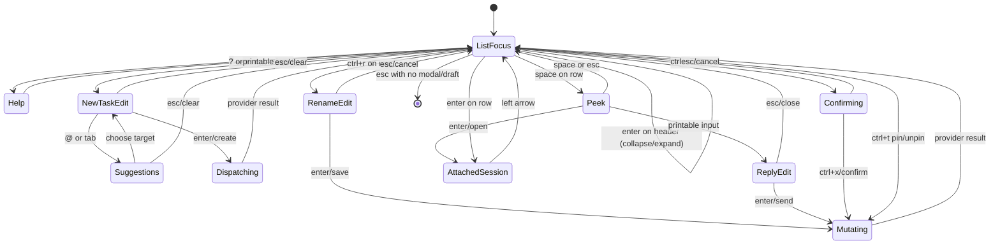

# Claude `agents` interface exploration

Explored on **2026-08-17**, between 14:45 and 15:20 EDT
(`America/Montreal`). This is a behavioral compatibility note for
`open-agent-view`, not a claim that Claude's private implementation is a stable
API.

## Scope and safety

The reference command was run against the existing host session store. The
exploration was intentionally non-mutating at the session level:

- no task was dispatched;
- no reply was sent;
- no session was stopped, deleted, pinned, or renamed;
- no existing container was entered or changed;
- draft text used to expose composer states was cleared with escape;
- full session views were opened read-only and immediately left with the left
  arrow.

Section collapse/expand, grouping changes, selection, help, and terminal resize
were the only persistent-looking UI actions exercised. A disposable tmux PTY
made it possible to capture the rendered screen at fixed sizes without relying
on terminal scrollback reconstruction.

The first preflight `claude --version` returned `2.1.233 (Claude Code)`. Claude
updated itself while this exploration was starting. Every TUI capture reported
`v2.1.234`, and the final version check returned `2.1.234 (Claude Code)`. The
installed 2.1.234 executable had filesystem mtime
`2026-08-17 15:11:14 -0400`. The two supplied screenshots show 2.1.233, so the
minor live differences below should not be mistaken for screenshot errors.

## Evidence sources

Directly observed evidence came from:

```text
claude --version
claude agents --help
claude agents
claude agents --json --all
```

Interactive captures were made at `160x45`, `100x30`, `80x24`, `60x24`,
`40x20`, and `100x12`. The installed executable's printable UI strings were
also inspected to disambiguate labels that terminal escape sequences had split
across columns. Statements based on those strings rather than an exercised key
path are marked **inferred**.

## Invocation surface

`claude agents` describes itself as “Manage background agents.” Relevant
options observed in `--help` are:

- `--json`, with `--all` to include completed sessions;
- `--cwd <path>` to filter by start directory;
- dispatch defaults: `--agent`, `--model`, `--effort`,
  `--permission-mode`, and `--add-dir`;
- settings/plugin/MCP inputs, including `--settings`, `--setting-sources`,
  `--plugin-dir`, `--mcp-config`, and `--strict-mcp-config`.

The TUI includes completed background sessions without requiring `--all`.
At the same point in time, `--json --all` returned both unnamed
`kind: "interactive"` processes and named `kind: "background"` records, while
the visible TUI rows corresponded to the nine named background records.

The background JSON fields observed were `id`, `pid` (not present on every
completed record), `cwd`, `kind`, `startedAt`, `sessionId`, `name`, `status`
(not universal), and `state`. The visible examples covered `state` values
`working`, `blocked`, and `done`. This JSON is useful discovery input, but it
does not contain the row summary, link annotations, pin state, age basis, or
the finer “Ready for review” classification visible in the TUI.

## Wide-screen anatomy

At 160 columns, the status-grouped screen has four vertical regions:

1. A three-line product header.
2. A scrollable, grouped session list.
3. A fixed one-line new-task composer between two dim horizontal rules.
4. A fixed context-sensitive shortcut line.

The header is:

```text
 <three-line Claude mark>  Claude Code v2.1.234
                          Opus 5 (1M context) · ~/dev/agent-projects
                          1 awaiting input · 2 working · 6 completed
```

The exact model and context label reflect the current Claude configuration.
The path changes with view context: status grouping showed the launch/filter
root, while directory grouping showed the selected session's project.

The default status sections, in order, are:

```text
Ready for review
Needs input
Working
Completed
```

There is a blank line between sections. Completed rows are packed without a
blank line between every row. In status view, the section supplies the state,
so rows do not repeat a state word.

Each row reserves four conceptual columns:

```text
<activity glyph> <name>   <latest useful summary>   <link summary>   <age>
```

The name column has a stable width on wide layouts. The middle summary is
single-line and ellipsized with `…`. The right edge remains aligned: it can
contain a count such as `2 PRs`/`19 PRs`, a numbered link such as `#1`, and a
compact age such as `56s`, `19m`, `20h`, or `18d`. Numbered links were emitted
as OSC 8 terminal hyperlinks.

Colors observed in the 256-color captures were approximately:

| Element | Color |
| --- | --- |
| Claude mark | xterm 174 |
| Most secondary text and rules | xterm 246 |
| review/attention accent | xterm 220 |
| completed accent | xterm 114 |
| selected row background | xterm 237 |
| selected foreground | xterm 231 |

The glyph itself animates through several Claude spinner forms without input.
One completed row used a static middle-dot-like glyph while the other rows
continued cycling. Glyph shape should therefore be treated as activity/backend
decoration, not as the sole source of truth for normalized state.

### Selection

A selected session receives a full-row dark background; its primary text is
bright, and the name may be bold. A selected section header receives a dark
background only on the header line and becomes bold. Selection is real even
though the new-task composer remains drawn with a `❯` prompt below it.

Up/down navigation traverses both headers and session rows. It is cyclic:
pressing down on the final completed row wrapped to the first section header.
Collapsed children are removed from that traversal. The selected session
identity survived a switch between grouping modes.

At short heights the list scrolls just enough to retain the selected item. The
product header and section headers are not sticky and can scroll completely
off screen. The composer and shortcut footer remain fixed.

## The two list views

`ctrl+s` toggles the list between the status view above and a directory/project
view.

The directory view groups rows beneath abbreviated paths, for example:

```text
~/dev/agent-projects
~/dev
~/dev/cuarm
~/dev/webarena-setup-cloudflare
```

Rows in this view insert an explicit state label before the summary:

```text
<glyph> <name>   Working · <summary>   <links> <age>
<glyph> <name>   Done · <summary>      <links> <age>
```

The blocked and review examples were both shown with the broad `Working` label
in this view. A session whose JSON cwd was inside
`.claude/worktrees/<worktree>` appeared under its owning repository path rather
than the literal nested worktree path. **Inference:** grouping canonicalizes
Claude worktrees to their project root.

The status header's `1 awaiting input · 2 working · 6 completed` is coarser
than the four sections. In the observed data, the JSON `blocked` record became
“Needs input”; most JSON `done` records became “Completed”; a JSON `working`
record could be either “Working” or “Ready for review.” **Inference:** the TUI
combines the stored state with transcript/activity metadata to derive the
review bucket. A clone should preserve an explicit `review` state when an
adapter provides it and should not attempt to derive it from the coarse JSON
state alone.

No stable within-section sorting rule was established. The displayed order was
not simply youngest-first or oldest-first. Preserve provider order until a
separate ordering contract is verified.

## Header collapse/expand

Selecting a section header changes the footer to:

```text
enter to collapse · ctrl+x to delete all · ? for shortcuts
```

Enter collapses it. The header then appends a dim child count, such as
`Needs input 1`, and the footer changes `collapse` to `expand`. Enter expands
it again.

`ctrl+x` was deliberately not exercised. **Inference from the installed UI
labels:** it targets every session in that group and must be guarded by a
confirmation state in an open implementation.

## Session peek and reply

With a row selected, space opens a rounded, bottom-anchored peek card in place
of the global new-task composer. The row stays selected in the list. The card
showed:

- the full latest useful message rather than the one-line truncation;
- related numbered links and, where available, additions/deletions and a check
  mark;
- an empty `❯ reply` field.

Before reply text is entered, the footer was:

```text
enter to open · space to close · ctrl+x to delete
```

Typing a harmless draft changed `❯ reply` to `❯ x` and the footer to:

```text
enter to send · esc to close · ctrl+x to delete
```

Escape closed the peek and removed the draft. Sending was not tested. The peek
is the fastest path for a one-line steering reply and should remain distinct
from attaching to the full Claude session.

## Full session attachment and return

Enter on a row replaces the agents list with the normal, full Claude session
transcript for that background job. This is not a custom detail page: the
usual conversation transcript, input box, permission/auto-mode line, PR links,
monitor/shell status, and token-saving hint are visible. Both a blocked working
session and a completed session were opened successfully without entering
text.

The attached session footer includes a left-arrow affordance such as
`← for agents` or `← 1 agent`. Left returns to the agents list with the same row
selected. Once attached in the current process, the list action for that row
was rendered as `enter to return` rather than `enter to open`.

The generic action is therefore contextual:

- `open` for a normal detached row;
- `return` for the originating/already attached row;
- **inferred:** `resume` for an ended session that must be restarted before it
  can be attached.

Attaching to a completed session exposed an ordinary Claude prompt with a
“new task?” hint. Entering text there would resume/change that session; a
read-only detail implementation must never send input merely to inspect it.

## New-task composer and suggestions

With the list focused, any printable character immediately starts editing the
fixed bottom composer and removes the row highlight. A one-character draft
produced:

```text
❯ x
enter to create · esc to clear
```

Escape cleared the draft and restored the previous list selection. Enter was
not tested because it would dispatch a session. `ctrl+j for newline` is
advertised in help.

Typing `@` opened a suggestion overlay directly above the composer. It
contained named background-agent templates and repository/worktree targets,
with a kind and description/path beside each item. The selected suggestion
used the suggestion accent color. Tab on an otherwise empty composer opened a
smaller picker containing background-agent templates. Escape closed these
overlays; a subsequent escape/repaint returned the unobscured list when the
overlay had occupied most of a short viewport.

This is more than textual autocomplete: a mentioned repo selects launch
context, while a mentioned background agent selects a dispatch template.
Open-agent-view should model selected targets structurally and serialize them
only at the adapter boundary.

## Context-sensitive shortcuts

The compact footer hides actions as width decreases. `?` expands it into a
multirow help footer, also context-sensitive.

For an active row at 160 columns, the exact observed help items were:

```text
ctrl+r to rename          ctrl+j for newline    ctrl+t to pin to top    ctrl+x to stop    ? to close
ctrl+s to switch views    @ to mention          alt+1-2 to open         esc to quit
```

For a completed row, `ctrl+x to stop` became `ctrl+x to delete`; one selected
row advertised `alt+1-5 to open`. The `alt+1-N` bound is dynamic. An Alt+1 PTY
probe transitioned into a related full session view, but tmux's legacy Alt
encoding makes the exact target-selection semantics insufficiently certain.
Treat this as a numbered open-target shortcut, not as a contract about PR link
counts.

For a section header, row-only actions such as rename, pin, and stop/delete
were omitted. The header help retained view switching, newline, mention,
numbered-open targets when available, quit, and close-help.

Additional behavior:

- `?` closes expanded help; escape also closed it in the observed run.
- `ctrl+r` put the selected name into an inline editing state with a cursor and
  changed the footer to `enter to save · esc to cancel`. Escape was used.
- `ctrl+t` pinning was advertised but intentionally not exercised.
- **inferred from installed labels:** a pinned item can expose
  shift+up/down reordering and the pin label changes to “unpin.”
- **inferred from installed labels:** destructive `ctrl+x` is armed first;
  another `ctrl+x` confirms, while escape keeps the item. A running item may
  pass through stopped before deletion.

## Escape, back, and focus rules

Escape is modal rather than globally synonymous with quit:

| Current state | Observed escape behavior |
| --- | --- |
| Expanded help | closes help |
| Non-empty new-task draft | clears draft and restores list focus |
| Suggestion overlay | closes the overlay/input mode |
| Inline rename | cancels rename |
| Peek/reply | closes peek and removes the unsent draft |
| Empty list state | exits `claude agents` |

Left arrow, not escape, is the primary return path from the fully attached
Claude session. **Inference from installed help:** when the agents view is
itself entered from another Claude conversation, an additional back state can
advertise left arrow, and escape may need to close that state before a second
escape quits.

The app uses the terminal alternate screen, bracketed paste, focus reporting,
and mouse tracking. The cursor is hidden while the list repaints and shown in
editable fields. **Inference supported by the installed event handlers:** rows
and headers are clickable, hyperlink clicks pass through, hover changes focus,
and the mouse wheel scrolls the list in small increments.

## Responsive behavior

The layout is adaptive rather than a separate narrow-screen design:

- At 160 and 100 columns, the three-line Claude mark, header, summary column,
  right metadata columns, composer, and full compact footer all fit.
- At 80 columns, the same row structure remains; the summary is shortened more
  aggressively while the link/age columns remain aligned.
- At 60 columns, the text header remains but the Claude mark is omitted. The
  compact footer drops lower-priority actions, showing only `enter`, `space`,
  and `?` for the selected row in the observed state.
- At 40 columns, the summary can collapse to a single `…` while the name,
  link, and age columns are still attempted. The footer reduced to `enter` and
  `?`.
- At only 12 rows high, the selected item drove the scroll window and could
  push the product header and all earlier section headings off screen. The
  four composer/footer rows stayed fixed.

The installed UI hides the Claude mark below 70 columns, matching the 60-column
observation. Exact cutoff values are implementation details; an open clone
should use semantic priorities: selection/name first, then state, age, links,
summary, optional shortcuts, and finally decorative branding.

There was no visible scrollbar or “more above/below” marker in the main list.
Keyboard wrap and selection-follow scrolling are therefore important for
discoverability.

## Refresh behavior

No manual refresh command appears in compact or expanded help. The screen is
live:

- activity glyph frames changed continuously without input;
- age labels were recomputed;
- a completed row's displayed summary changed between captures while the
  process remained open;
- the terminal title changed to include the aggregate attention count (for
  example, `1 awaiting input · claude agents`).

External session mutation was not induced, so the precise polling/subscription
interval was not measured. **Inference:** an implementation should refresh
provider snapshots independently of the animation tick, preserve selection by
stable session ID, and treat Docker/provider events as invalidation rather than
forcing the user to press a refresh key.

## Relationship to the supplied screenshots

The screenshots are the same status-grouped view observed here:

- three-line mark/product/model/count header at the upper left;
- `Ready for review`, `Needs input`, `Working`, and `Completed` sections only
  when non-empty;
- aligned single-line rows with names, ellipsized summaries, links, and ages;
- large unused vertical space on a tall terminal;
- bottom task composer and context shortcut line.

The first screenshot contains all four sections and the same aggregate counts
as the live run. The second has no `Ready for review` section because that
bucket is empty. Its visible count/state differences are ordinary live data
differences. Both report 2.1.233; the live captures report 2.1.234. No material
layout regression was observed across that update.

## Reproduction state machine

The following is the smallest state machine that reproduces every exercised
interaction while keeping destructive/provider actions explicit:



`Dispatching`, `Mutating`, and `Confirming` are shown for completeness but were
not exercised. In open-agent-view they must be adapter-driven, failure-aware,
and authorized separately from observation.

## Compatibility priorities for open-agent-view

The behaviors worth reproducing faithfully are:

1. stable-ID selection across refresh and grouping changes;
2. status and directory groupings, with collapsible headers in the navigation
   order;
3. aggressive single-line truncation that preserves name, state, age, and
   action/link metadata;
4. the separation between inline peek/reply and full provider attachment;
5. modal, context-sensitive help/footer labels;
6. printable-to-compose and escape-to-clear/return behavior;
7. cyclic navigation and selected-item-follow scrolling at small heights;
8. explicit confirmation for stop/delete and no side effects from refresh;
9. provider-native detail views where possible, with a clear left-arrow path
   back to the dashboard.

Pixel-level Claude branding is deliberately not a compatibility requirement.
The open implementation should use its own name/mark while retaining the
information density and interaction grammar documented above.
